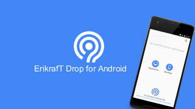
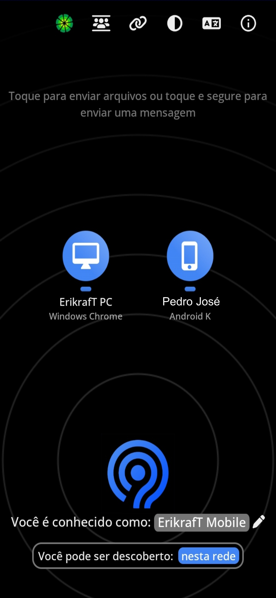
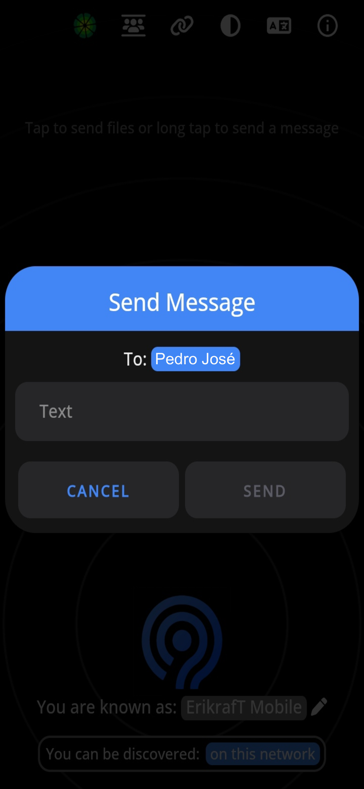
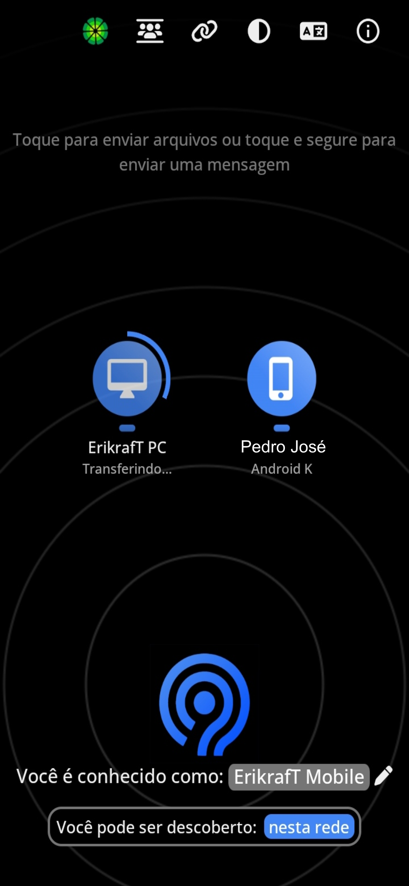

 

 

｜ErikrafT Drop available on the Web and also as Extensions: [CLICK HERE](https://github.com/erikraft/Drop/)

# ErikrafT Drop for Android

**ErikrafT Drop for Android** is an android client for the free and open source local file sharing solution https://drop.erikraft.com/. 

>[!TIP]
>Do you also sometimes have the problem that you just need to quickly transfer a file from your phone to the PC?
>
> - USB? - Old fashioned!
> - Bluetooth? - Too much cumbersome and slow!
> - E-mail? - Please not another email I write to myself!
> - ErikrafT Drop!

ErikrafT Drop is a local file sharing solution which completely works in your browser. A bit like Apple's Airdrop, but not only for Apple devices. Windows, Linux, Android, IPhone, Mac - no problem at all!

However, even if it theoretically would fully work in your browser and you don't have to install anything, you will love this app if you want to use ErikrafT Drop more often in your daily life. Thanks to perfect integration into the Android operating system, files are sent even faster. Directly from within other apps you can select ErikrafT Drop to share with. Thanks to its radical simplicity, "ErikrafT Drop for Android" makes the everyday life of hundreds of users easier. As an open source project we don't have any commercial interests but want to make the world a little bit better. Join and convince yourself!

## Where can I download the app?
**ErikrafT Drop for Android** is available on [Google Play](https://play.google.com/store/apps/details?id=com.erikraft.drop) and [F-Droid](https://f-droid.org/en/packages/com.erikraft.drop/). 

 
  
  

## Screenshots
</img> </img> </img> </img>

## Support ErikrafT Drop
➡️ [See how you can support this app and the ErikrafT Drop community](https://ko-fi.com/erikraft/)

## Contributing
**ErikrafT Drop for Android** would like to become a community project. I invite your participation through issues and pull requests! Also bug reports are very welcome! But note that this is **not** the right place to report bugs regarding the **ErikrafT Drop website** which occur independently of this app.

### Development
If you want to help with development, this would be more than welcome! I am very glad about every pull request. Just fork the repo and start coding. However, if you plan to implement larger changes, please tell us in the [issue tracker](https://github.com/erikraft/Drop-Android/issues) before hacking on your great new feature.

### Play Store automation
This repository ships with a GitHub Actions workflow (`Publish to Google Play`) that automatically builds a release bundle and uploads it to the Google Play Store whenever changes are pushed to the `main` branch. To enable the workflow:

1. Create a Google Cloud service account with access to the Google Play Developer API and download its JSON key.
2. Base64 encode the JSON key file and store it as the `GOOGLE_PLAY_SERVICE_ACCOUNT_JSON` secret in the repository settings.
3. Adjust the default track (`production`) or release status (`completed`) by editing the environment variables in `.github/workflows/play-store-publish.yml` if needed.

The workflow relies on the Gradle Play Publisher plugin and will run `./gradlew publishReleaseBundle` to upload the generated app bundle to the selected track.

### Self-hosted F-Droid automation
The project also includes a workflow (`Publish to self-hosted F-Droid repo`) that prepares an F-Droid compatible repository whenever a GitHub release is published (you can also trigger it manually through the *Actions* tab). The workflow builds the signed APK, updates the metadata under `fdroid/`, generates the F-Droid index using [`fdroidserver`](https://gitlab.com/fdroid/fdroidserver), and publishes the result to the `fdroid` branch which can be served through GitHub Pages or any static hosting provider.

To enable the workflow:

1. Base64-encode the keystore that is used to sign production releases and save it as the `FDROID_KEYSTORE_BASE64` secret.
2. Add the passwords and alias of that keystore as repository secrets: `FDROID_KEYSTORE_PASSWORD`, `FDROID_KEY_PASSWORD`, and `FDROID_KEY_ALIAS`.
3. (Optional) Provide custom repository metadata by defining the secrets `FDROID_REPO_URL`, `FDROID_REPO_NAME`, `FDROID_REPO_DESCRIPTION`, and `FDROID_REPO_ADDRESS`. Default values are used when they are not supplied.
4. Enable GitHub Pages for the repository (or configure another static host) to serve the contents of the `fdroid` branch so that F-Droid clients can consume the index.

After the first successful run you will have a fully automated, self-hosted F-Droid catalogue that mirrors the signed releases from this repository.

## Other software
### Related software
- ErikrafT Drop Web Extension for desktop platforms: [ErikrafT Drop Web Extension](https://github.com/erikraft/Drop/tree/master/Browser%20Extension)
- And for sure, ErikrafT Drop directly inside the browser - just use it everywhere: https://drop.erikraft.com/

### Alternatives
- Apple Airdrop (Mac and IOS only, plus an unofficial [open source implementation](https://github.com/seemoo-lab/opendrop) for Linux) 
- Google Nearby Share (Android, Chrome OS and [Windows](https://www.android.com/better-together/nearby-share-app/), plus an unofficial [macOS client](https://github.com/grishka/NearDrop))
- Windows Nearby Sharing (Windows only, there is a [FLOSS implementation](https://github.com/ShortDevelopment/Nearby-Sharing-Windows) for android)
- Link to Windows (Your Android phone will be mounted as storage directly in your Windows file explorer, [read more](https://blogs.windows.com/windows-insider/2024/07/25/ability-to-access-your-android-phone-in-file-explorer-begins-rolling-out-to-windows-insiders/))
