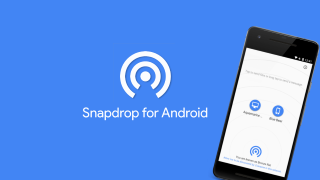
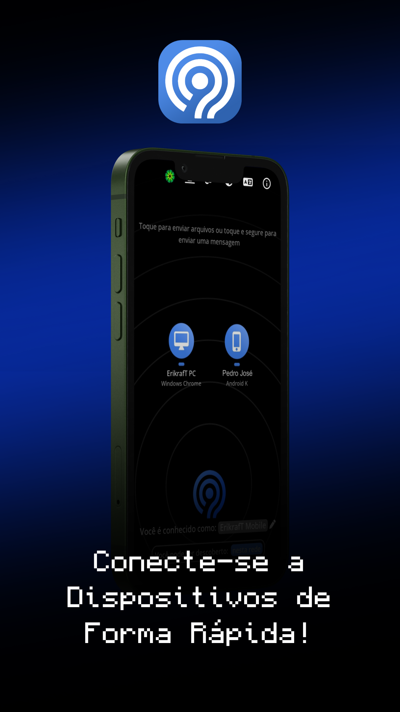
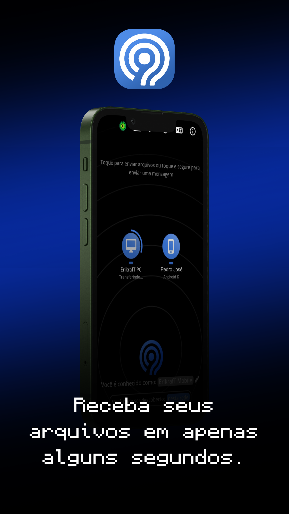
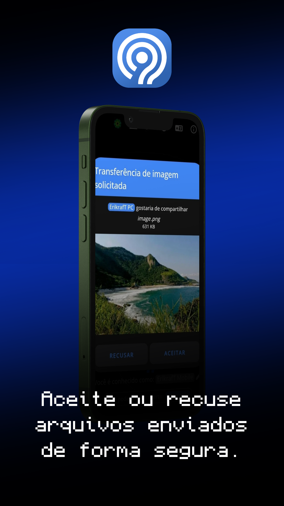
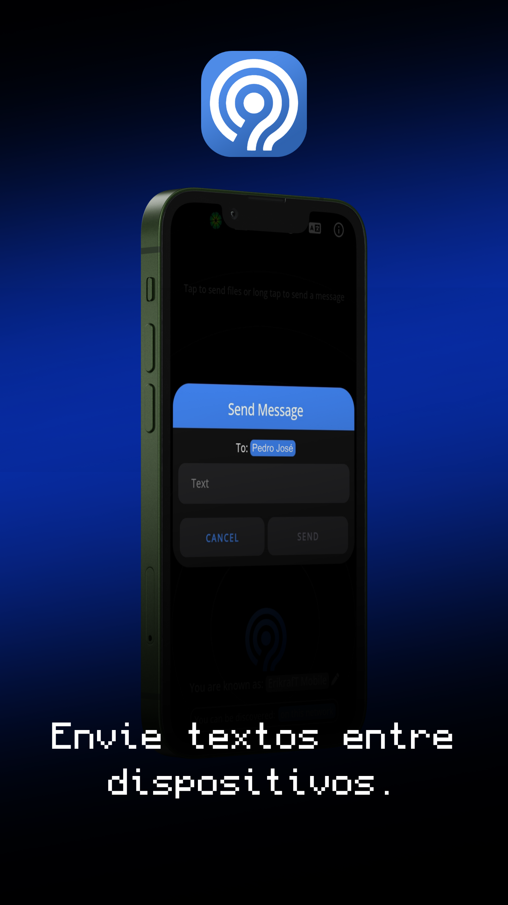

｜ErikrafT Drop available on the Web and also as Extensions: [CLICK HERE](https://github.com/erikraft/Drop/)

# ErikrafT Drop™ for Android

**ErikrafT Drop™ for Android** is an Android client for the free and open source local file sharing solution https://drop.erikraft.com/.

>[!TIP]
>Do you also sometimes have the problem that you just need to quickly transfer a file from your phone to the PC?
>
> - USB? - Old fashioned!
> - Bluetooth? - Too much cumbersome and slow!
> - E-mail? - Please not another email I write to myself!
> - ErikrafT Drop!

ErikrafT Drop is a local file sharing solution which completely works in your browser. A bit like Apple's Airdrop, but not only for Apple devices. Windows, Linux, Android, IPhone, Mac - no problem at all!

### 📱 Features
- **Server fallback priority**: `https://drop.erikraft.com/` (Primary), `https://drop-fallback.erikraft.com/` (Secondary), `https://dropfallback.erikraft.com/` (Tertiary), `https://pairdrop.net/` (Quaternary / competitor). Custom servers remain supported.
- **ERIKRAFT-QR Protocol**: Offline animated QR transfer (Send File, Send Text, Receive Animated QR) using Fountain FEC, CRC32, and SHA-256 integrity verification. Works completely offline in Airplane mode without Wi-Fi, Bluetooth, or server connection.
- **Advanced WebView & WebRTC**: Full WebRTC and WebSocket peer-to-peer file sharing and chat compatible with the official ErikrafT Drop instances and PairDrop.
- **Tor .onion Network**: Supports accessing .onion addresses through system SOCKS5 proxy / Orbot configuration.

However, even if it theoretically would fully work in your browser and you don't have to install anything, you will love this app if you want to use ErikrafT Drop more often in your daily life. Thanks to perfect integration into the Android operating system, files are sent even faster. Directly from within other apps you can select ErikrafT Drop to share with. Thanks to its radical simplicity, "ErikrafT Drop™ for Android" makes the everyday life of hundreds of users easier. As an open source project we don't have any commercial interests but want to make the world a little bit better. Join and convince yourself!

## ⏬｜Where can I download the app?
**ErikrafT Drop™ for Android** is available on [Google Play](https://play.google.com/store/apps/details?id=com.erikraft.drop) and [F-Droid](https://f-droid.org/en/packages/com.erikraft.drop/).

## 📲｜Screenshots
</img> </img> </img> </img> </img> </img>

## 💰｜Support ErikrafT Drop
➡️ [See how you can support this app and the ErikrafT Drop community](https://ko-fi.com/erikraft/)

## 🙏🏻｜Contributing
**ErikrafT Drop™ for Android** would like to become a community project. I invite your participation through issues and pull requests! Also bug reports are very welcome! But note that this is **not** the right place to report bugs regarding the **ErikrafT Drop website** which occur independently of this app.

### 🌎｜Translation Help
Want to help translate **ErikrafT Drop™ for Android** into your language? You can contribute to translations on our Crowdin project:

- [Help translate ErikrafT Drop™ for Android on Crowdin](https://crowdin.com/project/erikraft-drop-android)

Your contributions help make the app accessible to users worldwide!

### ✍🏻｜Development
If you want to help with development, this would be more than welcome! I am very glad about every pull request. Just fork the repo and start coding. However, if you plan to implement larger changes, please tell us in the [issue tracker](https://github.com/erikraft/Drop-Android/issues) before hacking on your great new feature.

### 🤖｜Release and Play Store automation
This repository includes a manual GitHub Actions release pipeline at `.github/workflows/release.yml` that builds and signs the mobile APK and AAB. It can also run automatically for version tags (`v*`).

For a signed release, configure these repository/environment secrets:

- `KEYSTORE_FILE`: Base64-encoded Android keystore file.
- `KEY_ALIAS`: Alias of the signing key.
- `KEYSTORE_PASSWORD`: Keystore password.
- `KEY_PASSWORD`: Signing key password.

The workflow validates that all signing inputs are present, keeps the keystore in the temporary runner directory, removes it after the job, builds both APK and AAB, and verifies the resulting signatures. It also builds against Android 16 (API 36) and refreshes the `ErikrafT-Drop` web submodule from its `master` branch.

> **Current Android app version:** `10.0.3` (version code `20`).
> **Target/Compile SDK:** Android 16 / API 36.

The Android application and the web application use independent version numbers. The web application version is maintained in the `ErikrafT/Drop` repository.
